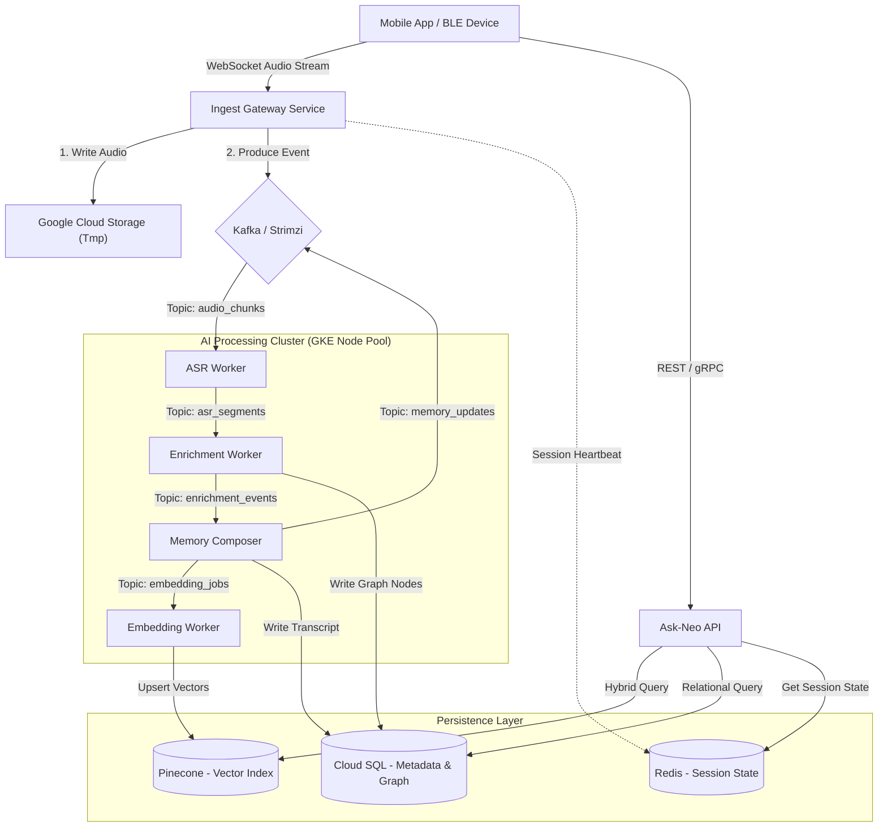

# Technical Architecture: Neo 1 "Clean-Room" Backend

**Status:** Draft / Blueprint
**Target Infrastructure:** GCP (Google Kubernetes Engine)
**Core Pattern:** Event-Driven Microservices + RAG (Retrieval Augmented Generation)

---

## 1. High-Level Overview

This system is a **real-time voice intelligence platform** designed to capture audio, transcribe it instantly, and organize it into a queryable "Second Brain." It strictly separates **ingestion** (high throughput, low latency) from **intelligence** (high compute, asynchronous processing).

### The "Spine"

1. **Ingest:** Mobile app streams audio via WebSocket.
2. **Buffer:** Audio chunks are buffered in object storage (GCS) and pointers are sent to Kafka.
3. **Process:** Workers consume events to Transcribe -> Analyze -> Embed.
4. **Retrieve:** A "Hybrid Graph" engine queries both Vector Memory (Pinecone) and Relational Context (Postgres).

---

## 2. System Architecture Diagram



---

## 3. Microservices Breakdown

All services are containerized (Docker) and deployed on **GKE**.

| Service Name | Language | Type | Responsibility |
| --- | --- | --- | --- |
| **`ingest-gateway`** | Python (FastAPI) | HTTP/WS | Terminates WebSockets. Handles auth (JWT). Buffers audio chunks (100ms) and pushes to Kafka. **Stateless** (scales horizontally). |
| **`asr-worker`** | Python | Consumer | Consumes `audio_chunks`. Runs VAD (Voice Activity Detection). Calls Whisper ASR. Produces `asr_segments`. |
| **`enrichment-worker`** | Python | Consumer | Consumes `asr_segments`. Runs LLM (GPT-4o-mini) to extract **Tasks**, **Emotions**, and **Graph Entities**. |
| **`memory-composer`** | Python | Consumer | The "Scribe." Aggregates segments into a cohesive "Memory" object. Handles session finalization. |
| **`embedding-worker`** | Python | Consumer | Batches text segments. Calls Embedding API. Upserts vectors to **Pinecone** with temporal metadata. |
| **`ask-neo-api`** | Python (FastAPI) | HTTP | The "Brain." Handles user questions (RAG). Orchestrates the Hybrid Graph lookup. |
| **`notification-svc`** | Go / Python | Consumer | Listens for high-priority tasks in `enrichment_events` and pushes alerts to FCM/APNS. |

---

## 4. Data Architecture

We use **Polyglot Persistence** to optimize for specific access patterns.

### A. Postgres (Primary Source of Truth)

Hosted on **Google Cloud SQL**. Stores structured data and the "Knowledge Graph" structure.

**Key Tables:**

* `users`: Identity and encryption keys.
* `sessions`: Metadata for a recording session (start, end, device_id).
* `transcripts`: The raw text segments linked to sessions.
* `memories`: The finalized, summarized version of a session.
* **Graph Tables (The "Temporal Graph"):**
* `graph_nodes`: Entities (People, Companies, Topics).
* `graph_edges`: Relationships (`WORKS_AT`, `MET_WITH`) with `valid_from` / `valid_until` columns.


### B. Pinecone (Vector Memory)

Managed Serverless. Stores semantic meaning.

**Namespace Strategy:**

* `production`: Live user data.
* **Metadata Fields (Critical for Filtering):**
* `user_id`: Enforce tenancy.
* `created_at`: **Unix Timestamp (Int)** for temporal range queries.
* `type`: `segment` | `summary` | `entity`.
* `pg_node_id`: Link back to Postgres Graph Node (for Hybrid Search).


### C. Redis (Hot State)

Hosted on **Google Cloud Memorystore**.

* **Use Case:** Deduplication of Kafka messages, storing "Is user talking right now?" state, and Rate Limiting.

### D. Google Cloud Storage (GCS)

* **Bucket:** `neo-raw-audio-temp`
* **Lifecycle Policy:** Delete objects after **24 hours**. (Privacy compliance).

---

## 5. Event-Driven Topics (Kafka Schema)

We use **Protobuf** or strictly typed JSON for events.

| Topic Name | Partition Key | Payload Example |
| --- | --- | --- |
| `audio_chunks` | `session_id` | `{ session_id, seq_num, audio_b64, timestamp }` |
| `asr_segments` | `session_id` | `{ session_id, text, start_offset, end_offset }` |
| `enrichment_events` | `session_id` | `{ type: "TASK", data: { task: "Buy milk", due: "today" } }` |
| `embedding_jobs` | `user_id` | `{ text, metadata: { created_at: 1700100200 } }` |
| `deletion_requests` | `user_id` | `{ target_id, hard_delete: true }` |

---

## 6. Core Workflows (The "How-To")

### Flow 1: Ingestion & "Real-Time" Transcript

1. **Mobile App** opens WebSocket to `wss://api.neo.com/stream`.
2. **Ingest Gateway** validates JWT.
3. Audio bytes arrive. Gateway pushes to Kafka `audio_chunks`.
4. **ASR Worker** buffers 500ms -> Sends to Whisper -> Gets Text.
5. **ASR Worker** pushes "Partial Transcript" to a generic `ui_updates` topic (for live UI feedback).
6. Once sentence is complete, pushes to `asr_segments`.

### Flow 2: The "Ask Neo" (Hybrid RAG)

*User asks: "Who did I meet at Google last month?"*

1. **Orchestrator** parses query:
* *Time Filter:* `now() - 30 days` to `now()`.
* *Entities:* "Google".


2. **Parallel Execution:**
* **Vector Search (Pinecone):** Search for "meeting context" + Filter `created_at > (now-30d)`.
* **Graph Search (Postgres):**
* Find Node "Google" (via exact match or vector lookup).
* Query `graph_edges` for `MET_WITH` connected to "Google" node.


3. **Synthesis:** LLM receives:
* 3 Vector chunks (actual conversation snippets).
* 2 Graph facts ("You met 'Sarah' at Google on Oct 12").


4. **Response:** "You met Sarah at Google on Oct 12. You discussed API limits..."

---

## 7. Infrastructure & Deployment (GKE)

### Kubernetes Manifest Structure

```text
k8s/
├── base/
│   ├── deployment-gateway.yaml
│   ├── deployment-workers.yaml  # Scaled via KEDA (Kafka lag)
│   ├── service-redis.yaml
│   └── secrets.yaml             # SealedSecrets
├── overlays/
│   ├── production/              # GKE Autopilot config
│   └── local/                   # Minikube config

```

### Scaling Strategy (HPA)

* **Ingest Gateway:** Scales on CPU/Memory usage.
* **Workers:** Scale using **KEDA** (Kubernetes Event-driven Autoscaling) based on **Kafka Consumer Lag**.
* *If `audio_chunks` lag > 1000 messages -> Add 5 ASR pods.*


---

## 8. Security & Privacy Controls

1. **Ephemeral Audio:** The `audio_chunks` topic has a retention of 1 hour. GCS buckets have a 24-hour TTL.
2. **Tenant Isolation:** Every SQL query includes `WHERE user_id = X`. Every Pinecone query includes `filter={user_id: X}`.
3. **Deletion Propagation:** A `deletion_request` event triggers a "Fan-out" deletion:
* Delete Postgres Rows.
* Delete Pinecone Vectors (by ID).
* Delete Redis Cache keys.
* **Audit:** Log the *timestamp* of the deletion, but not the content.
